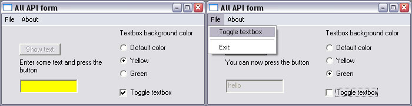



## All API form New version

### Description

Update to my previous submission. I added radio button, checkbox and menus. I also reorganised the APIControls module so you can use it in any project. I hope you find it interesting. -- Updated to correct the small bug Vlad reported :)
 
### More Info
 

             |
---                |---
**Submitted On**   |2003-11-01 16:23:50
**By**             |[Frédéric Côté](https://github.com/Planet-Source-Code/PSCIndex/blob/master/ByAuthor/fr-d-ric-c-t.md)
**Level**          |Intermediate
**User Rating**    |4.8 (24 globes from 5 users)
**Compatibility**  |VB 6\.0
**Category**       |[Windows API Call/ Explanation](https://github.com/Planet-Source-Code/PSCIndex/blob/master/ByCategory/windows-api-call-explanation__1-39.md)
**World**          |[Visual Basic](https://github.com/Planet-Source-Code/PSCIndex/blob/master/ByWorld/visual-basic.md)
**Archive File**   |[All\_API\_fo1665961112003\.zip](https://github.com/Planet-Source-Code/fr-d-ric-c-t-all-api-form-new-version__1-49583/archive/master.zip)

